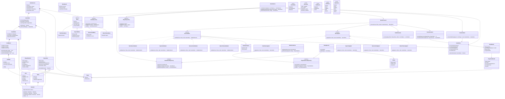

```mermaid
classDiagram

class GameSession {
+String id
+List~Player~ players
+GameState state
+List~Move~ moveHistory
+GameStatus status
}

class GameState {
+Int currentPlayerIndex
+BoardState boardState
+List~PlayerState~ playerStates
+isFinished(): Boolean
+getCurrentPlayer(): PlayerState
}

class BoardState {
+CardMarket cardMarket
+List~Noble~ availableNobles
+TokenSet bankTokens
}

class CardMarket {
+CardRow levelOne
+CardRow levelTwo
+CardRow levelThree
+getCard(cardId: String): Card
+removeCard(cardId: String)
+drawFromDeck(level: Int): Card
}

class CardRow {
+Int level
+List~Card~ deck
+List~Card~ openCards
+refill()
}

class Player {
+String id
+String name
}

class PlayerState {
+Player player
+TokenSet tokens
+List~Card~ purchasedCards
+List~Card~ reservedCards
+List~Noble~ nobles
+calculateBonuses(): TokenSet
}

class Card {
+String id
+CardColor color
+Int level
+Int points
+TokenSet cost
}

class Noble {
+String id
+Int points
+TokenSet requirement
}

class TokenSet {
+Map~TokenColor~ tokens
+plus(other: TokenSet): TokenSet
+minus(other: TokenSet): TokenSet
+containsAtLeast(other: TokenSet): Boolean
+total(): Int
}

class Move {
<<abstract>>
+String id
+String playerId
+MoveType type
+Long createdAt
}

class TakeTokensMove {
+TokenSet tokens
}

class BuyCardMove {
+String cardId
+CardSource source
+TokenSet payment
}

class ReserveCardMove {
+String cardId
+CardSource source
}

class ReturnTokensMove {
+TokenSet tokens
}

class MoveResult {
+Boolean success
+String message
+GameState newState
}

class GameResult {
+String gameId
+List~PlayerFinalResult~ results
+Player winner
+Long finishedAt
}

class PlayerFinalResult {
+Player player
+Int score
+Int purchasedCardsCount
+Int noblesCount
+Int place
}

class PlayerStatistics {
+Player player
+Int gamesPlayed
+Int wins
+Int totalScore
+Double averageScore
+Double winRate
}

class Rating {
+Player player
+Double value
+Int position
}

class GameRules {
+Int maxTokensPerPlayer
+Int tokensToEndGame
+Int pointsToEndGame
+Int openCardsPerLevel
+Int noblesCount
+isGameOver(state: GameState): Boolean
}

class MoveProcessor {
+process(move: Move, session: GameSession): MoveResult
}

class GameInitializer {
+createInitialState(players: List~Player~, rules: GameRules): GameState
}

class NobleEvaluator {
+evaluate(playerState: PlayerState, nobles: List~Noble~): List~Noble~
}

class MoveValidator {
<<interface>>
+validate(move: Move, state: GameState): ValidationResult
}

class TakeTokensValidator {
+validate(move: Move, state: GameState): ValidationResult
}

class BuyCardValidator {
+validate(move: Move, state: GameState): ValidationResult
}

class ReserveCardValidator {
+validate(move: Move, state: GameState): ValidationResult
}

class ReturnTokensValidator {
+validate(move: Move, state: GameState): ValidationResult
}

class ValidationResult {
+Boolean valid
+String reason
}

class MoveApplier {
<<interface>>
+apply(move: Move, state: GameState): GameState
}

class TakeTokensApplier {
+apply(move: Move, state: GameState): GameState
}

class BuyCardApplier {
+apply(move: Move, state: GameState): GameState
}

class ReserveCardApplier {
+apply(move: Move, state: GameState): GameState
}

class ReturnTokensApplier {
+apply(move: Move, state: GameState): GameState
}

class ScoreCalculator {
+calculatePlayerScore(playerState: PlayerState): Int
+calculateGameResult(session: GameSession): GameResult
}

class GameService {
+createSession(players: List~Player~): GameSession
+makeMove(sessionId: String, move: Move): MoveResult
+finishGame(sessionId: String): GameResult
}

class StatisticsService {
+updateStatistics(result: GameResult)
+getStatistics(playerId: String): PlayerStatistics
}

class RatingService {
+recalculate()
+getRating(): List~Rating~
}

class GameRepository {
<<interface>>
+save(session: GameSession)
+findById(id: String): GameSession
+findAll(): List~GameSession~
}

class GameResultRepository {
<<interface>>
+save(result: GameResult)
+findByGameId(gameId: String): GameResult
+findByPlayer(playerId: String): List~GameResult~
}

class PlayerRepository {
<<interface>>
+save(player: Player)
+findById(id: String): Player
+findAll(): List~Player~
}

class PlayerStatisticsRepository {
<<interface>>
+save(statistics: PlayerStatistics)
+findByPlayerId(playerId: String): PlayerStatistics
+findAll(): List~PlayerStatistics~
}

class GameStatus {
<<enum>>
CREATED
IN_PROGRESS
FINISHED
}

class MoveType {
<<enum>>
TAKE_TOKENS
BUY_CARD
RESERVE_CARD
RETURN_TOKENS
}

class CardSource {
<<enum>>
MARKET
RESERVED
DECK
}

class CardColor {
<<enum>>
WHITE
BLUE
GREEN
RED
BLACK
}

class TokenColor {
<<enum>>
WHITE
BLUE
GREEN
RED
BLACK
GOLD
}

GameSession "1" *-- "1" GameState
GameSession "1" o-- "2..4" Player
GameSession "1" *-- "0..*" Move

GameState "1" *-- "1" BoardState
GameState "1" *-- "2..4" PlayerState

BoardState "1" *-- "1" CardMarket
BoardState "1" o-- "0..*" Noble
BoardState "1" *-- "1" TokenSet

CardMarket "1" *-- "3" CardRow
CardRow "1" o-- "0..*" Card

PlayerState "1" --> "1" Player
PlayerState "1" *-- "1" TokenSet
PlayerState "1" o-- "0..*" Card
PlayerState "1" o-- "0..*" Noble

Card "1" *-- "1" TokenSet
Noble "1" *-- "1" TokenSet

Move <|-- TakeTokensMove
Move <|-- BuyCardMove
Move <|-- ReserveCardMove
Move <|-- ReturnTokensMove

MoveValidator <|.. TakeTokensValidator
MoveValidator <|.. BuyCardValidator
MoveValidator <|.. ReserveCardValidator
MoveValidator <|.. ReturnTokensValidator

MoveApplier <|.. TakeTokensApplier
MoveApplier <|.. BuyCardApplier
MoveApplier <|.. ReserveCardApplier
MoveApplier <|.. ReturnTokensApplier

MoveProcessor --> MoveValidator
MoveProcessor --> MoveApplier
MoveProcessor --> NobleEvaluator
MoveProcessor --> ScoreCalculator

GameService --> GameRepository
GameService --> GameResultRepository
GameService --> PlayerRepository
GameService --> MoveProcessor
GameService --> GameInitializer
GameService --> GameRules

GameInitializer --> GameRules

MoveValidator --> ValidationResult
MoveValidator --> GameRules
ScoreCalculator --> GameResult

StatisticsService --> PlayerStatisticsRepository
StatisticsService --> GameResultRepository

RatingService --> PlayerStatisticsRepository
RatingService --> Rating

PlayerStatistics --> Player
Rating --> Player
GameResult --> PlayerFinalResult
PlayerFinalResult --> Player
```
