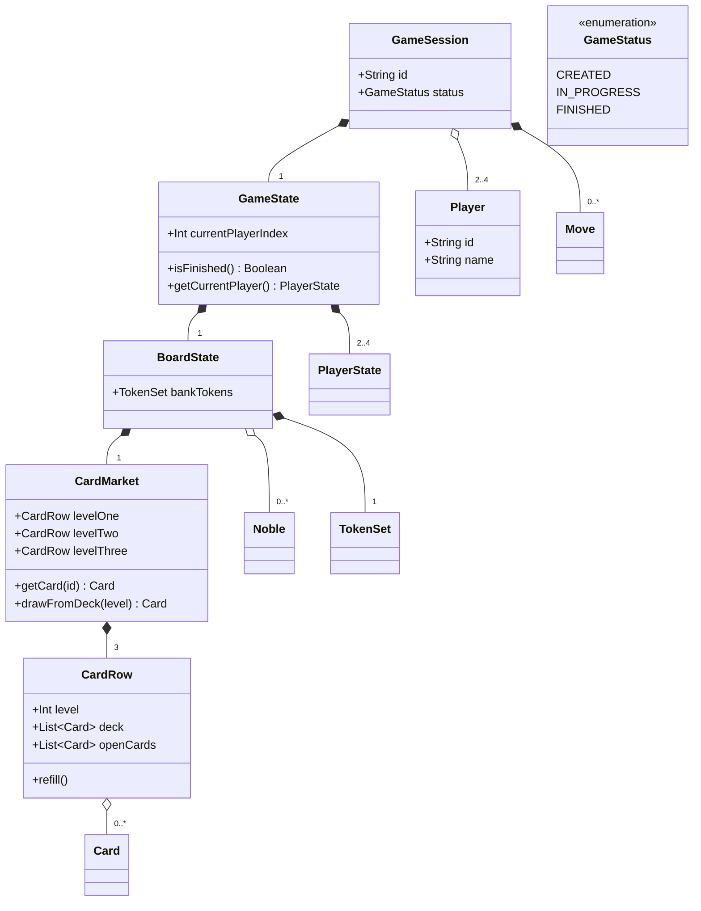
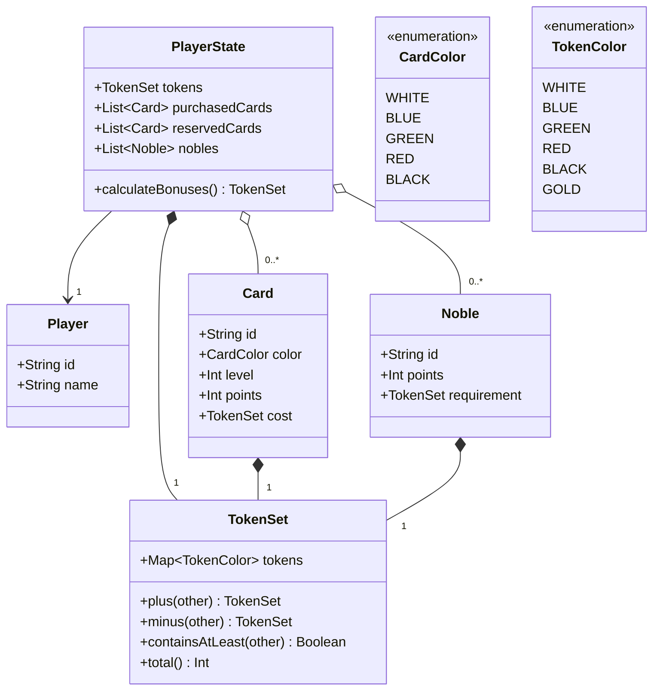
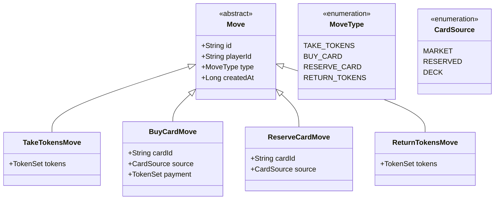
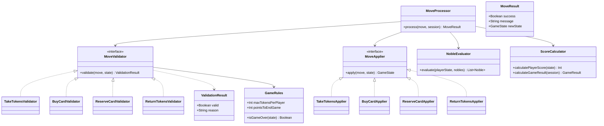
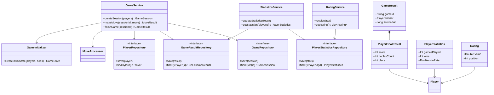

# Splendor — Architecture Diagrams
 
## 1. Игровая сессия и доска
 
`GameSession` — корневая сущность. 

 
---
 
## 2. Игрок и доменные объекты
 

 
---
 
## 3. Ходы
 

 
---
 
## 4. Обработка хода
 

 
---
 
## 5. Сервисы, репозитории и результаты
 

 
